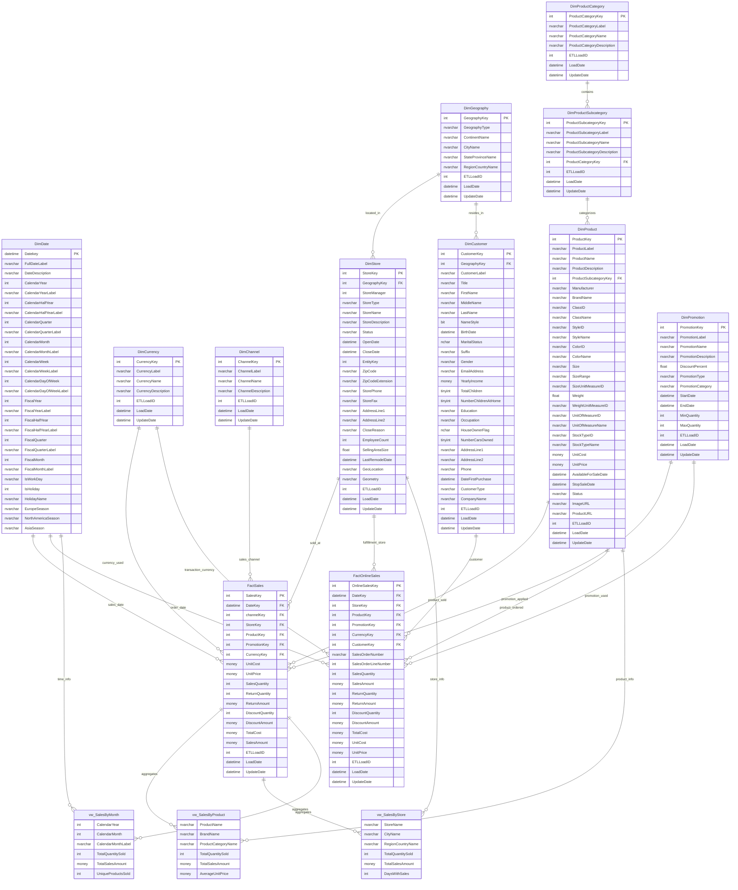

# Contoso Local Database - Schema Diagram

## Database Overview

**Database:** ContosoRetailDW (Local Version)  
**Schema:** cso  
**Architecture:** Simplified Star Schema  
**Purpose:** Local development and testing environment  

## Entity Relationship Diagram

## Schema Legend

- **Dimension Tables (Dim\*):** Master data tables with descriptive attributes
- **Fact Tables (Fact\*):** Transaction tables with measurable business metrics
- **Views (vw_\*):** Pre-built analytical views for common reporting needs
- **PK:** Primary Key (Identity columns)
- **FK:** Foreign Key (References other tables)
- **Relationships:** Lines show foreign key constraints and data flow

## Key Features

- **Simplified Structure:** Focused on core retail operations
- **Sample Data:** Pre-populated with test data for 2023
- **Performance Optimized:** Includes indexes on fact table foreign keys
- **Analytical Views:** Ready-to-use views for common business questions

## Business Areas Covered

- **Product Management:** Categories, subcategories, and product details
- **Store Operations:** Store locations and geographic information
- **Customer Management:** Customer demographics and purchase history
- **Sales Tracking:** In-store and online sales transactions
- **Promotions:** Discount and promotional campaign tracking
- **Time Intelligence:** Complete date dimension for temporal analysis

## Sample Data Included

- **Currencies:** USD, EUR, GBP, CAD, JPY
- **Channels:** Store, Online, Catalog, Reseller
- **Geographies:** 9 cities across North America, Europe, and Asia
- **Product Categories:** 8 categories (Audio, TV, Computers, etc.)
- **Products:** 6 sample Contoso brand products
- **Stores:** 5 flagship stores in major cities
- **Customers:** 5 sample customer profiles
- **Promotions:** 5 promotional campaigns
- **Sales Data:** 18 sales transactions and 10 online orders
- **Date Range:** Complete 2023 calendar year

## Table Details

### Dimension Tables

| Table | Purpose | Key Relationships |
|-------|---------|-------------------|
| DimDate | Time dimension with calendar and fiscal periods | Referenced by all fact tables |
| DimGeography | Geographic locations (cities, states, countries) | Referenced by DimStore, DimCustomer |
| DimProductCategory | Product categories (Audio, TV, Computers, etc.) | Parent of DimProductSubcategory |
| DimProductSubcategory | Product subcategories | Child of DimProductCategory, parent of DimProduct |
| DimProduct | Individual products with detailed attributes | Referenced by fact tables |
| DimStore | Store locations and details | Referenced by fact tables |
| DimCustomer | Customer demographics and information | Referenced by FactOnlineSales |
| DimChannel | Sales channels (Store, Online, Catalog, Reseller) | Referenced by FactSales |
| DimCurrency | Currency definitions | Referenced by all fact tables |
| DimPromotion | Promotional campaigns and discounts | Referenced by fact tables |

### Fact Tables

| Table | Purpose | Grain |
|-------|---------|-------|
| FactSales | In-store sales transactions | One row per product sold per transaction |
| FactOnlineSales | Online sales orders | One row per product per online order line |

### Analytical Views

| View | Purpose |
|------|---------|
| vw_SalesByProduct | Sales aggregated by product and category |
| vw_SalesByStore | Sales aggregated by store and location |
| vw_SalesByMonth | Sales aggregated by month and year |
